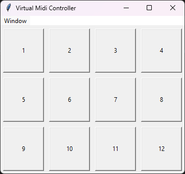
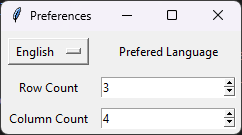
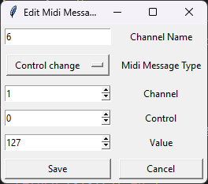
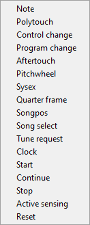

# Virtual Midi Controller

This is a virtual midi controller. It is a simple program that allows you to send midi messages to a midi device. It is written in python and uses the [RtMidi](https://www.music.mcgill.ca/~gary/rtmidi/) library. Due to Windows not supporting virtual midi devices, this program only works on Linux and Mac.
Thanks to Github Copilot, there is support for both English and Spanish. If you notice any mistakes, please let me know! If you want to expand on the supported languages, just add the translated strings in [`translation_strings.py`](translation_strings.py).

## Setup

`pip install -r requirements.txt` will install the required libraries.

With this, you should be able to run the program with `python Virtual_Midi_Controller.py`.

If you want to create an executable, you can use `pyinstaller` to create an executable. You have to explicitly include the `rtmidi` library in the `--hidden-import` argument. For example, `pyinstaller --onefile --hidden-import rtmidi Virtual_Midi_Controller.py` will create an executable.

## Configuration

Currently, only buttons are supported in the GUI. In the settings, you can change the size of the grid.

By right clicking on a button, you can edit the midi parameters that are sent upon clicking.

